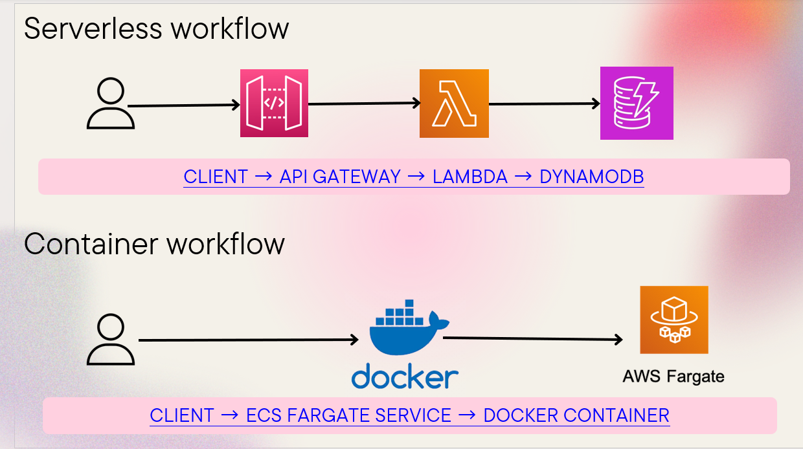

# Serverless vs Container on AWS — To-Do API

A comparative MSc Computing project implementing the same **To-Do API** using two AWS architectures and evaluating their performance, scalability, cost characteristics, and operational trade-offs.

- **Serverless:** AWS Lambda + API Gateway + DynamoDB
- **Containerised:** Flask + Docker + ECS Fargate

---

## 🏗️ Architecture

---

## 🛠️ Tech Stack

**AWS:** Lambda, API Gateway, DynamoDB, ECS Fargate, CloudWatch  
**Development:** Python, Flask, Docker, AWS SAM  
**Testing:** Apache JMeter

---

## 🔧 What I Built

- Developed the same CRUD To-Do API using serverless and container-based architectures.
- Deployed the serverless version using AWS SAM, Lambda, API Gateway and DynamoDB.
- Containerised the Flask API with Docker and deployed it to ECS Fargate.
- Performed load testing with Apache JMeter and monitored workloads using CloudWatch.
- Compared latency, throughput, error behaviour, scalability and operational characteristics.

---

## 📊 Recorded Test Results

Results from the recorded JMeter load tests:

| Metric | Serverless | Container |
|---|---:|---:|
| Samples | 2,400 | 1,400 |
| Average response time | **32 ms** | **112 ms** |
| Minimum response time | 11 ms | 20 ms |
| Maximum response time | 1,476 ms | 848 ms |
| Throughput | **11.7 req/s** | **10.8 req/s** |
| Error rate | **72.25%** | **0%** |

> **Note:** The recorded JMeter runs contain different sample counts, so these results represent the respective test runs rather than a perfectly controlled one-to-one benchmark.

CloudWatch monitoring captured Lambda duration, invocations, errors, throttles and concurrency, alongside CPU and memory utilisation for the container workload.

Detailed evidence is available in the [`docs`](docs/) folder and [`results`](results/) folder.

---

## 🔍 Serverless Load-Test Finding

The recorded serverless JMeter run produced a **72.25% error rate** under the tested load, compared with **0% for the containerised implementation**.

The accompanying CloudWatch evidence shows Lambda errors, throttling and concurrent-execution activity during the test. However, the original AWS environment has since been decommissioned, so the underlying CloudWatch logs are no longer available to conclusively attribute every failed request to a specific bottleneck.

This result is therefore reported as an observed load-testing outcome rather than assigning a definitive root cause that cannot be verified retrospectively.

---

## 🧠 Key Engineering Decisions

- **Serverless** reduced infrastructure management and provided automatic scaling, making it suitable for variable or bursty workloads.
- **Containers** provided a more controlled and consistent runtime environment for sustained workloads.
- The load tests demonstrated a clear trade-off: the serverless run recorded lower average latency, while the container run achieved **0% errors** under its recorded test load.
- Serverless can be cost-efficient for intermittent workloads, while continuously running Fargate tasks introduce a baseline compute cost.

---

## 📁 Project Structure

serverless-version/    → Lambda, API Gateway and DynamoDB implementation
container-version/     → Flask, Docker and ECS Fargate implementation
docs/                  → Architecture, AWS deployment and testing evidence
results/               → Detailed comparison results

---

## 💡 Lessons Learned

The comparison showed that performance and reliability can behave differently under load. The serverless implementation achieved a lower average response time (32 ms vs 112 ms), but the recorded test also produced a 72.25% error rate, while the container implementation recorded 0% errors.

This reinforced the importance of evaluating not only latency and scalability, but also reliability, service limits and workload characteristics when selecting a cloud architecture.

## 📜 License

MIT
